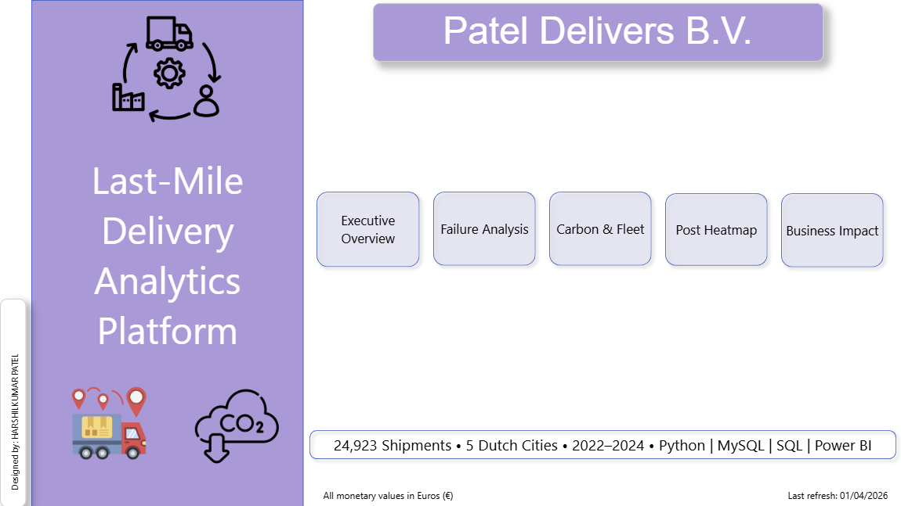

# Last-Mile Delivery Analytics - Dutch Logistics Platform 

> **1 in 10 parcels fails on first delivery attempt in the Netherlands.**  
> This project finds exactly where, exactly why, and what three actions recover **€146M in value at industry scale** — built end-to-end with Python, MySQL, SQL, and Power BI.

**Stack:** Python 3.10 · pandas · SQLAlchemy · MySQL 8.0 · Power BI Desktop · CBS StatLine · Open-Meteo API · PostNL 2023 benchmarks

---

## The Business Problem

Patel Delivers BV is a Dutch last-mile delivery startup operating across **5 cities** — Amsterdam, Rotterdam, Utrecht, Den Haag, and Eindhoven. Like every logistics operator in the Netherlands, they face two compounding problems:

**Operational Cost** — Every failed first-attempt delivery means sending a driver back a second time at full cost. At a 10.8% failure rate across 24,923 shipments, the wasted operational spend accumulates fast.

**Carbon Emissions** — 10.7% of every gram of CO₂ Pateldelivers emits produces zero value — burned on failed delivery trips. With EU sustainability reporting obligations tightening in 2026, this is no longer just an environmental metric. It is a financial and regulatory one.

Patel Delivers needed their first data analyst to answer three questions:
- **Where** are failures concentrated?
- **Why** are they happening?
- **What** should be done about it — and what is the quantified impact?

---

## Key Findings
[View Power BI Dashboard](https://app.powerbi.com/view?r=eyJrIjoiNTM0NzhjZDAtNGY1NS00MzRmLWFjMDItNzg3OTJiYzcwNjg1IiwidCI6ImM2ZTU0OWIzLTVmNDUtNDAzMi1hYWU5LWQ0MjQ0ZGM1YjJjNCJ9)

| Finding | Detail |
|---|---|
| 🔴 Rotterdam worst fail rate | 11.6% — 0.88pp above fleet average |
| 💰 Amsterdam highest cost | €4,047 wasted despite lowest fail rate — volume drives impact |
| 🏠 "Not home" dominates | 50.1% of all failures — consistent across every city |
| 🌱 Vehicle type irrelevant | All four types fail between 10.4 – 11% — electrify freely |
| 📍 3 Rotterdam postcodes | 3025, 3012, 3021 — no parcel lockers, highest priority |
| 📈 38 zones deteriorating | 38 of 99 postcode zones worse than historical baseline |

---

## Business Impact

Three recommendations, quantified at two scales:

| Recommendation | Annual Saving | CO₂ Saved | PostNL Scale |
|---|---|---|---|
| 🏪 Parcel lockers — Rotterdam 3025, 3012, 3021 | €91 | 14.7g | **€4,095,000** |
| 🤖 Predictive dispatch — all cities | €2,737 | 504.7g | **€123,165,000** |
| ⚡ Fleet electrification — 50% to 80% | €425 | 3,683g | **€19,125,000** |
| **Combined** | **€3,253** | **4,202g** | **€146,385,000** |

> *PostNL scale applies a 45,000x multiplier based on daily shipment volume ratio. Assumptions documented in `/sql/Q5_business_impact.sql`.*

---

## Dashboard Screenshots

### Home Page


### Executive Overview
 

### Failure Analysis — 50.1% "Not Home" Finding


### Carbon & Fleet — Vehicle Type Has Zero Impact on Fail Rate


### Postcode Heatmap — Rotterdam Priority Zones


### Business Impact — €146M at PostNL Scale


---

## Project Architecture

```
Excel Dataset (30,282 rows)
        │
        ▼
Python ETL Pipeline (pandas + SQLAlchemy)
        │
        ▼
MySQL Database — swiftroute schema
├── fact_deliveries      (24,923 rows)
├── dim_postcodes            (99 rows)
├── dim_drivers              (80 rows)
├── warehouse_inventory      (40 rows)
├── daily_volume_forecast (4,960 rows)
├── kpi_summary             (180 rows)
└── 5 analytical views (v_city_fail_analysis, etc.)
        │
        ▼
Power BI Dashboard (6 pages, connected live to MySQL)
```

---

## The 5 Business Questions

Every SQL file answers one specific business question:

| File | Business Question | Key Output |
|---|---|---|
| `Q1_city_fail_analysis.sql` | Where are deliveries failing and what does it cost? | Rotterdam 11.6%, Amsterdam €4,047 wasted |
| `Q2_fail_reason_analysis.sql` | Why are deliveries failing? | Not home = 50.1% of all failures |
| `Q3_vehicle_co2_analysis.sql` | What is the carbon cost? | 10.7% CO₂ wasted, fossil fleet emits 10× more |
| `Q4_postcode_risk_analysis.sql` | Which zones are highest risk? | 3 Rotterdam postcodes, no lockers |
| `Q5_business_impact.sql` | What should SwiftRoute do? | 3 recommendations, €146M at scale |

---

## Dashboard Pages

| Page | Title | Key Visual |
|---|---|---|
| 0 | Home | Navigation · 4 headline KPIs · 5 page cards |
| 1 | Executive Overview | OTD trend line — 3 years, 5 cities |
| 2 | Failure Analysis | Fail reason bar — Not home dominates |
| 3 | Carbon & Fleet | CO₂ by vehicle — fossil vs zero emission |
| 4 | Postcode Heatmap | Interactive map — bubble size = fail rate |
| 5 | Business Impact | 3 recommendations with €-impact |

---

## Data Architecture

### Real Dutch Data Sources

| Source | Data | License |
|---|---|---|
| CBS StatLine (83765NED) | PC4 postcode demographics | CC BY 4.0 |
| Open-Meteo API | Historical weather — all 5 cities | Free |
| Dutch Holidays Python library | Sinterklaas, Koningsdag, Pasen | Open source |

### Synthetic Operational Layer

The shipment-level transaction data is synthetically generated but calibrated to real benchmarks:
- **PostNL 2023 Annual Report** — 12% first-attempt fail rate baseline
- **CBS freight volume trends** — demand seasonality calibration
- **Dutch PC4 geodata** — real postcode coordinates and demographics

> This mirrors real-world data analyst work — raw operational data is commercially sensitive. The methodology is identical whether applied to synthetic or production data.

---

## SQL Techniques Used

This project demonstrates intermediate-to-senior SQL patterns:

- **Star schema design** — fact and dimension tables with proper cardinality
- **CTEs** — named intermediate results for clean, readable queries
- **Window functions** — `SUM() OVER()`, `PARTITION BY` for percentage calculations
- **CASE WHEN aggregation** — conditional counting and cost calculation
- **UNION ALL** — combining multiple query results
- **JOINs** — fact to dimension enrichment
- **Views** — reusable pre-calculated query layers for Power BI

---

## Repository Structure

```
swiftroute-analytics/
├── README.md
├── python/
│   └── load_all_tables.ipynb           ← ETL pipeline — Excel to MySQL
├── sql/
│   ├── Q1_city_fail_analysis.sql
│   ├── Q2_fail_reason_analysis.sql
│   ├── Q3_vehicle_co2_analysis.sql
│   ├── Q4_postcode_risk_analysis.sql
│   ├── Q5_business_impact.sql
│   └── views_create.sql                ← All 5 views in one file
├── powerbi/
│   ├── PatelDelivers_Dashboard.pbix
│   └── screenshots/
│       ├── 00_home_page.png
│       ├── 01_executive_overview.png
│       ├── 02_failure_analysis.png
│       ├── 03_carbon_fleet.png
│       ├── 04_postcode_heatmap.png
│       └── 05_business_impact.png
└── presentation/
    └── PatelDelivers_BV_Analysis.pptx
```

---

## How to Run This Project

**Prerequisites:**
- MySQL 8.0
- Python 3.10+
- Power BI Desktop
- Libraries: `pandas`, `sqlalchemy`, `mysql-connector-python`

**Step 1 — Create the database**
```sql
CREATE DATABASE swiftroute;
USE PatelDelivers;
```

**Step 2 — Run the ETL pipeline**
```bash
# Open load_all_tables.ipynb in Jupyter
# Update EXCEL_PATH to your local file location
# Run all cells — loads all 6 tables automatically
```

**Step 3 — Create analytical views**
```sql
-- Run views_create.sql in MySQL Workbench
-- Creates all 5 views used by Power BI
```

**Step 4 — Connect Power BI**
```
Get Data → MySQL Database
Server: localhost
Database: swiftroute
Select all 6 tables + 5 views → Load
```

---

## Key Analytical Lessons

**Rate vs absolute cost tell different stories** — Rotterdam has the worst fail rate but Amsterdam generates the most wasted cost. Prioritising by rate alone would direct budget to the wrong city. This distinction is what separates surface-level analysis from decision-ready insight.

**"Not home" is a scheduling problem, not an operational one** — 50.1% of failures happen because the customer was absent. The driver did everything correctly. The solution is predictive dispatch before departure, not operational improvement after the fact.

**Synthetic data requires documented calibration** — every parameter in this dataset is benchmarked against a published source. Data transparency is non-negotiable in professional analytics work, and proactively documenting assumptions builds more credibility than hiding them.

---

## About This Project

Built by **Harshilkumar Patel** — MBA Data Analytics graduate (Wittenborg University of Applied Sciences, Netherlands) — targeting intermediate data analyst roles in the Dutch logistics and supply chain sector.

This project was deliberately designed around two themes that are commercially relevant to every major Dutch logistics operator in 2026: operational cost reduction from failed deliveries, and EU CSRD carbon reporting compliance.

The methodology — business question first, data second, recommendation third — mirrors how analytics is applied in professional Dutch logistics teams at PostNL, DSV, and bol.com.

**Open to data analyst opportunities in the Netherlands.**  
[Connect on LinkedIn](https://www.linkedin.com/in/YOUR-LINKEDIN-URL) · [Portfolio](https://YOUR-PORTFOLIO-URL)

---

*Dataset: Synthetic, calibrated to PostNL 2023 benchmarks and CBS StatLine open data*  
*Period: January 2022 — December 2024*  
*Cities: Amsterdam, Rotterdam, Utrecht, Den Haag, Eindhoven*
